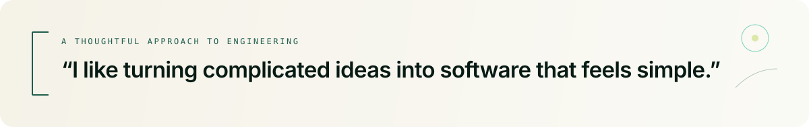
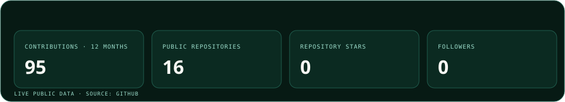
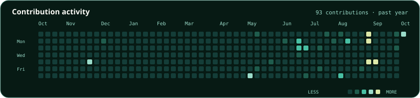

 

 

## A little about me

I’m **Krishna Mishra**, a Computer Science undergraduate at **MIT Academy of Engineering**. I build across AI and full-stack development, with a particular interest in turning complex ideas into useful, thoughtful products.

**Pune, India** · **MITAOE, 2025–2029** · **8.40 / 10.0 CGPA**

<table>
  <tr>
    <td width="50%"><strong>EXPLORING</strong> Generative AI · Agentic systems</td>
    <td width="50%"><strong>BUILDING WITH</strong> Python · React · Node.js · watsonx</td>
  </tr>
</table>

 

## Engineering focus

<table>
  <tr>
    <td width="50%"><strong>AI &amp; intelligence</strong> Generative AI · Machine learning · IBM watsonx · AI applications · Agentic workflows</td>
    <td width="50%"><strong>Product engineering</strong> React · Next.js · HTML · CSS · JavaScript · Node.js · Express · Flask · REST APIs</td>
  </tr>
  <tr>
    <td width="50%"><strong>Languages</strong> Python · JavaScript · C · Java</td>
    <td width="50%"><strong>Tools &amp; data</strong> Git · GitHub · VS Code · Tableau · Jupyter Notebook</td>
  </tr>
</table>

## Selected work

<table>
  <tr>
    <td>
      01 &nbsp;·&nbsp; CRYPTOGRAPHY
      <h3><a href="https://qlockain.onrender.com/">Qlockain Vault ↗</a></h3>
      
Cryptographic credential and document verification built around immutable SHA-256 ledger logic.

      Python &nbsp;·&nbsp; Flask &nbsp;·&nbsp; Blockchain &nbsp;·&nbsp; REST APIs
    </td>
  </tr>
  <tr>
    <td>
      02 &nbsp;·&nbsp; GENERATIVE AI
      <h3><a href="https://startup-mentor-jftd.onrender.com/">Startup Mentor AI ↗</a></h3>
      
AI-powered startup planning that generates structured business blueprints and downloadable PDFs.

      IBM watsonx &nbsp;·&nbsp; Node.js &nbsp;·&nbsp; Express &nbsp;·&nbsp; React
    </td>
  </tr>
  <tr>
    <td>
      03 &nbsp;·&nbsp; PREDICTIVE OPERATIONS
      <h3><a href="https://stadiumopsai-xi.vercel.app/">StadiumOps AI ↗</a></h3>
      
AI-assisted venue operations for modelling crowd flow, queue bottlenecks, gate distribution, and rapid response.

      Next.js &nbsp;·&nbsp; React &nbsp;·&nbsp; Crowd analytics
    </td>
  </tr>
</table>

<a href="https://kris13.netlify.app/#projects">More projects &amp; case studies →</a>

## Experience

<table>
  <tr>
    <td width="34">◦</td>
    <td><strong>Co-Founder</strong> · Indian Pixel Co-leading product and technology initiatives across websites, software, and digital platforms.</td>
  </tr>
  <tr>
    <td>◦</td>
    <td><strong>Frontend &amp; UI/UX Design Intern</strong> · Drishyam Contributed to responsive frontend experiences and explored Computer Vision and Edge AI for security.</td>
  </tr>
  <tr>
    <td>◦</td>
    <td><strong>Artificial Intelligence Intern</strong> · CodeAlpha     Built Python AI applications, including an FAQ chatbot and a language translation tool.</td>
  </tr>
  <tr>
    <td>◦</td>
    <td><strong>AI &amp; Cloud Intern</strong> · IBM SkillsBuild / Edunet Foundation Worked with IBM Cloud, watsonx, Python, machine learning, and Generative AI.</td>
  </tr>
</table>

## Problem solving

## Currently exploring

Generative AI · Agentic systems · AI-powered products · Production-ready software

## GitHub activity

 

## Have an interesting problem?

### Let’s build something useful.

<a href="https://kris13.netlify.app">Portfolio</a> &nbsp;·&nbsp;
<a href="https://www.linkedin.com/in/krishnamishra13/">LinkedIn</a> &nbsp;·&nbsp;
<a href="mailto:krishna1307mishra@gmail.com">Email</a> &nbsp;·&nbsp;
<a href="https://github.com/me13krishna">GitHub</a>

  

